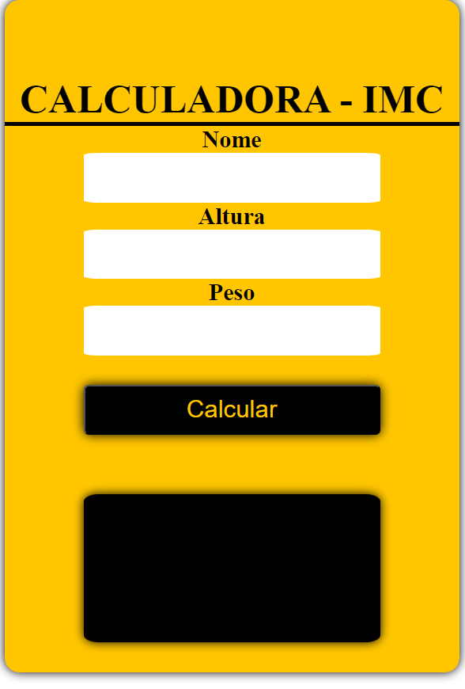

Calculadora Simples IMC com JavaScript

   

Um projeto inspirado no [Desafios JavaScript](https://sobrinhosergio.github.io/desafios-javascript/#00---calculadora-imc) 

🚀 Funcionalidades
Com esta calculadora você consegue ver se o seu IMC está bom, e recebe feedback.
💻 Como Utilizar
Abra o arquivo IMC.html em seu navegador.
Insira seu nome e os dados nas caixas de texto apropriadas.
Clique no botão "Calcular" para obter o resultado.
🌟 Contribuições 
Se você é um desenvolvedor aspirante, sinta-se à vontade para contribuir para o aprimoramento desta calculadora. Faça um fork do projeto e envie suas melhorias por meio de pull requests.

Lembre-se, este é um projeto em constante evolução, e sua participação é valorizada!

Divirta-se codificando! 🚀
